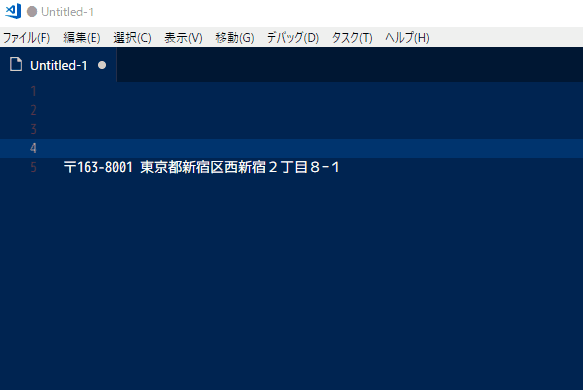
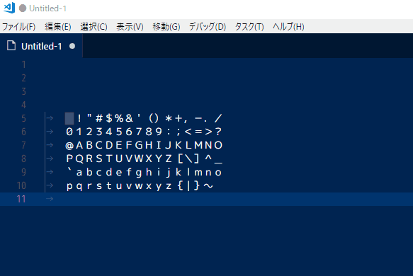

# Hankaku Zenkaku Ascii

## Features

Convert these characters to full-width <-> half-width characters.

	 !"#$%&'()*+,-./
	0123456789:;<=>?
	@ABCDEFGHIJKLMNO
	PQRSTUVWXYZ[\]^_
	`abcdefghijklmno
	pqrstuvwxyz{|}~
	↑↓
	　！＂＃＄％＆＇（）＊＋，－．／
	０１２３４５６７８９：；＜＝＞？
	＠ＡＢＣＤＥＦＧＨＩＪＫＬＭＮＯ
	ＰＱＲＳＴＵＶＷＸＹＺ［＼］＾＿
	｀ａｂｃｄｅｆｇｈｉｊｋｌｍｎｏ
	ｐｑｒｓｔｕｖｗｘｙｚ｛｜｝～

## Available Command
* extension.hankakuAscii : Convert zenkaku ascii characters to hankaku
* extension.zenkakuAscii : Convert hankaku ascii characters to zenkaku

## Known Issues
It does not correspond to half/full-width katakana.

